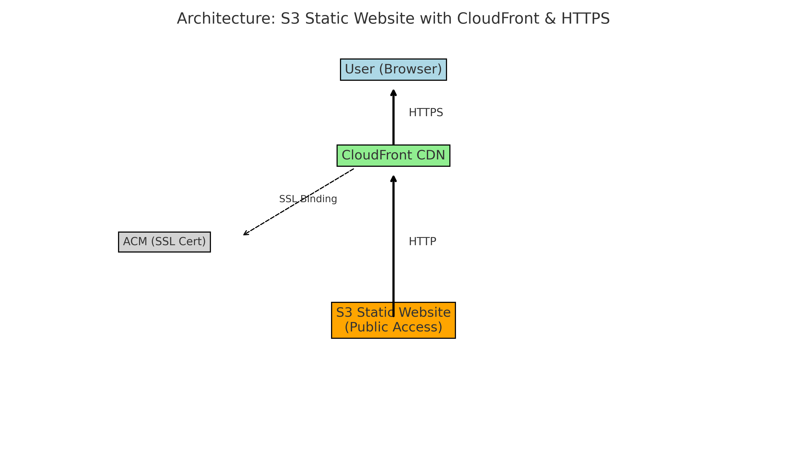

# 🌐 AWS Static Website Hosting with S3 and CloudFront

This is my first AWS cloud project — a static website hosted on **Amazon S3**, delivered globally via **CloudFront**, and served securely over **HTTPS**.

## 🚀 Why I Built This
  
This project helped me understand:
- How to configure and host static websites in S3
- How to secure content with CloudFront + HTTPS
- The basics of IAM policies and static website architecture

## 🛠️ Services Used

- Amazon S3 (static site hosting)
- CloudFront (CDN + HTTPS)
- IAM (bucket policy for public access)
- Certificate Manager (ACM – optional)

## 🧱 Architecture

## 🔗 Live Demo

[https://dezbo4vgsb4qi.cloudfront.net/](https://dezbo4vgsb4qi.cloudfront.net/)
